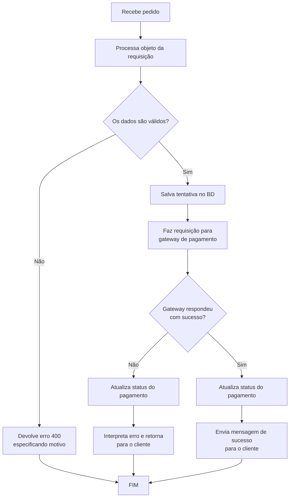
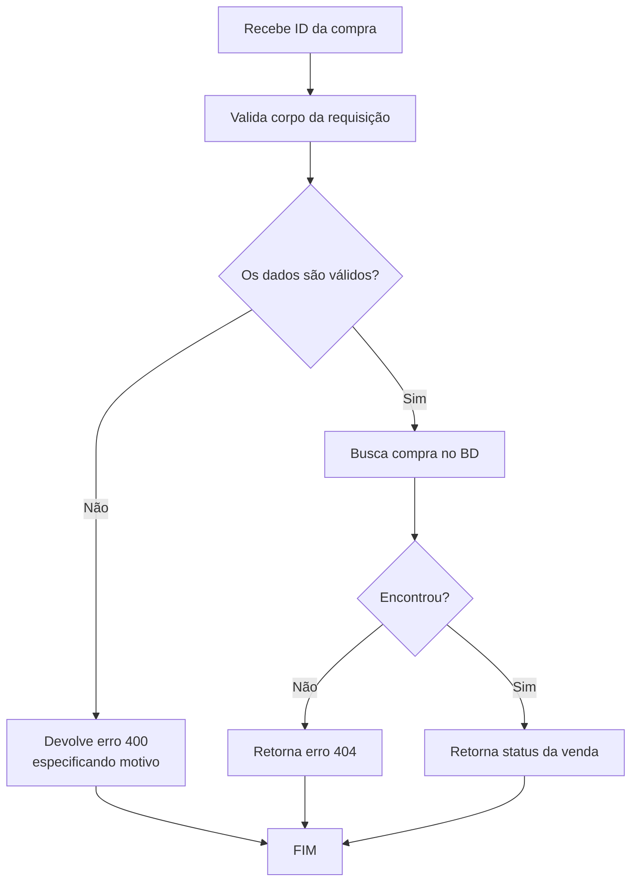
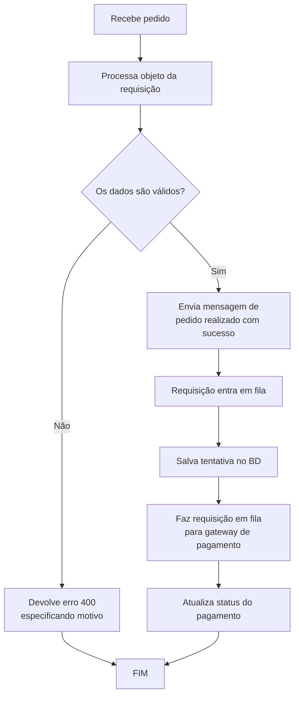
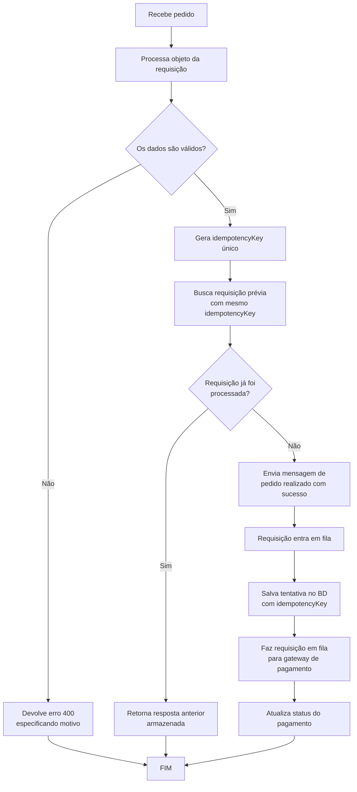
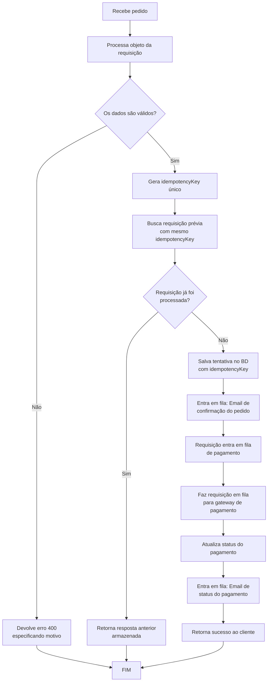

# Objetivos

Criar uma API responsável por receber requisições de pagamentos com cartão de crédito que seja capaz de lidar com alta carga, idempotência e mensageira.
O intuito é ter um produto resiliente e confiável. Ou seja, quando ele receber uma requisição, sem comportamento deve ser determinístico conforme os critérios de produto.

# Critérios de produto (MVP)

- Receber objeto com dados de compras:
  - produto;
  - valor;
  - dados do cartão de crédito;
  - dados do cliente.
- Processar requisições:
  - Salvar imediatamente a venda;
  - Processar o pagamento;
  - Informar o cliente do pagamento.

# Critérios de arquitetura

- Arquitetura camadas modulares (inspiração NestJs)
  - Controllers (recebem a requisição)
  - Services (regra de negócios)
  - Repositories (acesso ao banco de dados)
- Orientação a Objetos
- Tipagem obrigatória

# Critérios de desenvolvimento

## Modelagem

### Order (Postgres)

```javascript
	model Order
	// <>Dados universais<>
	id uuid
	createdAt Date // UTC
	updatedAt Date // UTC
	// <>Dados da venda<>
	productId string // Sem significado atual. Pós MVP: deve referenciar ao model do produto
	price Number // Dado do cliente
	customerName String
	customerEmail String
	// <>Dados do pagamento<>
	paymentType Enum (CARD)
	paymentId String // id fornecido pelo gateway
	gatewayId String // id do gateway
	paymentStatus Enum (PENDING | PAIED | DENIED | CANCELED)
```

### IdempotencyKey (Redis)

```javascript
	Key: idempotencyKey (string - UUID)
	Value: {
		response: Object {
			orderId: string,
			paymentStatus: string,
			message: string
		},
		createdAt: timestamp (ISO8601),
		expiresAt: timestamp (ISO8601)
	}
	TTL: 86400 // 24 horas em segundos
```

## Tecnologias e bibliotecas (JavaScript)

### Principais

- Typescript
- PostgreSQL
- Redis
- Docker

### Secundárias

- Fastify (Servidor)
- Prisma (ORM)
- Zod (validações)
- Resend (e-mail)
- Pino (logger)
- BullMQ (filas)

## Segurança (MVP)

### Princípios

- **Nunca armazenar dados sensíveis**: Cartão de crédito só é trafegado para gateway, nunca armazenado nem logado
- **Validação rigorosa**: Zod para validar entrada
- **Sanitização**: Remover caracteres perigosos
- **HTTPS obrigatório**: Comunicação criptografada

### Implementação

1. **Cartão de crédito**
   - Enviar diretamente ao gateway (tokenização)
   - Armazenar apenas `paymentId` (token do gateway)
   - Nunca logar números de cartão ou CVV

2. **Validação de entrada**
   - Usar Zod para validar tipos, formatos e ranges
   - Validar: email, UUID, regex para cartão e CVV

3. **Rate limiting**
   - N requisições por IP a cada X minutos
   - Implementar com middleware

## Observabilidade (MVP)

### Estrutura de Log

- Formato JSON estruturado
- Campos: timestamp, level, service, traceId, context, message, metadata
- Cada requisição deve ter um traceId único para rastreamento

### Eventos a Logar

| Evento                             | Level | Contexto                         |
| ---------------------------------- | ----- | -------------------------------- |
| Pedido recebido                    | INFO  | orderId, customerId              |
| Validação falhou                   | WARN  | orderId, motivo                  |
| Idempotência - duplicata detectada | INFO  | orderId, idempotencyKey          |
| Enviado ao gateway                 | INFO  | orderId, gatewayId               |
| Resposta do gateway recebida       | INFO  | orderId, paymentStatus           |
| Email enfileirado                  | INFO  | orderId, emailType               |
| Erro no gateway                    | ERROR | orderId, errorCode, errorMessage |
| Retry de fila                      | WARN  | jobId, tentativa                 |

### Ferramentas

- **Logger**: Estruturado em JSON
- **Centralização**: ELK Stack ou Datadog (pós-MVP)

## Filas com Retry (MVP)

### Sistema de Fila

- **Tecnologia**: BullMQ (construído sobre Redis)
- **Jobs críticos**:
  1. Requisição ao gateway de pagamento
  2. Envio de emails

### Estratégia de Retry

- **Máximo de tentativas**: 3
- **Backoff**: Exponencial (2s → 4s → 8s)
- **Falha final**: Dead Letter Queue

### Dead Letter Queue

Após 3 tentativas falhadas, o job entra em quarentena:

- Não é reprocessado automaticamente
- Disponível para investigação manual
- Alerta deve ser gerado para DevOps

## Rotas da API

### [POST] `/order`

Efetiva uma compra.

```json

    "product" : {
        "id": "string",
        "price": "number"
    },
    "customer": {
        "name": "string",
        "email": "string"
    },
    "payment": {
        "type": "string/enum (CARD)",
        "card": {
            "number": "string",
            "holderName": "string",
            "cvv": "string",
            "expirationDate": "string (MM/YY)"
        }
    }
```

### [GET] `/order/id/status`

Consulta o status de um pedido.

## Fluxograma da API - bases (MVP 0.1)

### Compra (sem fila)



### Verificar status da compra



## Fluxograma da API - fila (MVP 0.2)

### Compra



## Fluxograma da API - idempotência (MVP 0.3)

### Compra com idempotência



## Fluxograma da API - mensageria (MVP 0.4)

### Compra com idempotência e eventos de email



# Implementação

## Faseamento de Tecnologias

A implementação será feita de forma incremental, adotando novas tecnologias conforme necessário.

### Fase 1 - MVP 0.1 (Base)

**Escopo**: API síncrona básica sem fila

**Stack**:

- Node.js + Fastify
- PostgreSQL (Orders)
- Zod (validação)
- Prisma (ORM)
- Pino (logs)
- HTTPS (comunicação criptografada)

**Infraestrutura**:

- 1 servidor Fastify
- 1 banco PostgreSQL
- 1 gateway de pagamento (fake/mock)

---

### Fase 2 - MVP 0.2 (Fila de Processamento)

**Stack adicional**:

- Redis (message broker)
- BullMQ (fila de jobs)

**Mudanças**:

- Requisição entra em fila após validação
- Worker processa pagamento assincronamente
- Retry com backoff exponencial
- Dead Letter Queue para falhas

**Infraestrutura**:

- 1 servidor Fastify
- 1 banco PostgreSQL
- 1 Redis
- N workers de pagamento

---

### Fase 3 - MVP 0.3 (Idempotência + Rate Limiting)

**Stack adicional**:

- Redis (idempotency store)

**Mudanças**:

- Gerar `idempotencyKey` na API
- Verificar se requisição já foi processada antes de fila
- Cachear respostas por 24h em Redis
- **Rate limiting por cliente**: Máximo de requisições por cliente/email por período
- Implementar sliding window ou token bucket

**Infraestrutura**:

- Mesma do MVP 0.2
- Separação lógica: Redis para cache vs Redis para fila (ou mesma instância com namespaces)

---

### Fase 4 - MVP 0.4 (Mensageria)

**Stack adicional**:

- Resend (serviço de email)
- BullMQ (fila de emails)

**Mudanças**:

- Email de confirmação do pedido na fila
- Email de status do pagamento na fila
- Workers de email processam de forma independente

**Infraestrutura**:

- Mesma do MVP 0.3
- 1 queue adicional para emails
- N workers de email

---

## Diagrama de Adoção Tecnológica

```
MVP 0.1
├─ Fastify
├─ PostgreSQL
├─ Zod
└─ Pino

    ↓ Adiciona

MVP 0.2
├─ Redis (fila)
├─ BullMQ
└─ Retry/DLQ

    ↓ Adiciona

MVP 0.3
├─ Redis (cache)
├─ Idempotência
└─ Rate Limiting

    ↓ Adiciona

MVP 0.4
├─ Resend
├─ BullMQ (emails)
└─ Notificações
```

---

## Checklist de Implementação

### MVP 0.1

- [x] Projeto Fastify + TypeScript
- [x] Modelo de dados (Prisma)
- [x] Validação com Zod
- [x] Rota [POST] /order
- [x] Rota [GET] /order/:id/status
- [x] Integração com gateway (mock)
- [x] Logs estruturados (Pino)
- [x] Docker Compose (PostgreSQL)

### MVP 0.2

- [ ] Docker Compose (Redis)
- [ ] BullMQ setup
- [ ] Worker de pagamento
- [ ] Retry logic
- [ ] Dead Letter Queue
- [ ] Monitoramento de filas

### MVP 0.3

- [ ] Redis store para idempotência
- [ ] Geração de idempotencyKey
- [ ] Cache de respostas
- [ ] TTL de 24h
- [ ] Rate limiting por cliente
- [ ] Sliding window ou token bucket

### MVP 0.4

- [ ] Resend API setup
- [ ] Template de emails
- [ ] BullMQ queue de emails
- [ ] Worker de email
- [ ] Eventos de email
