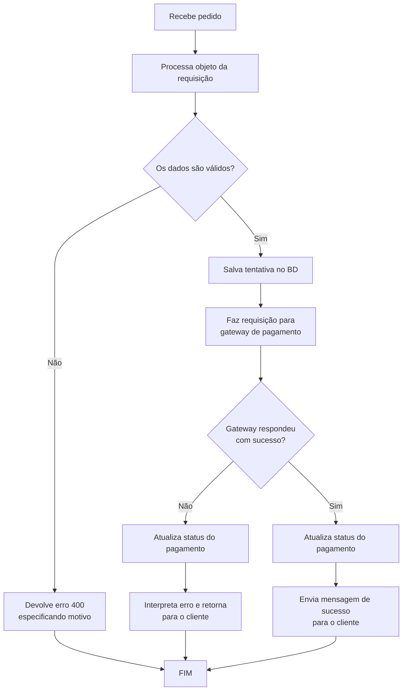
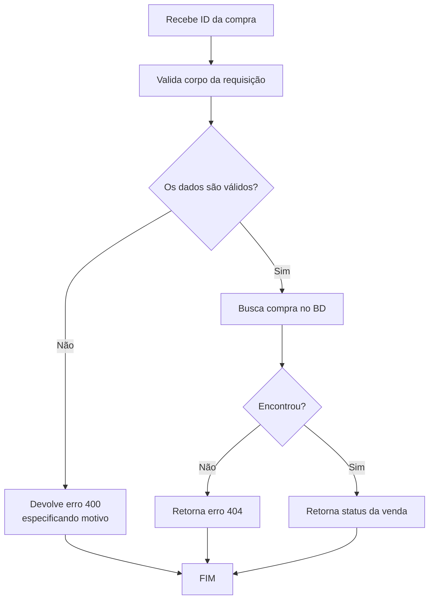
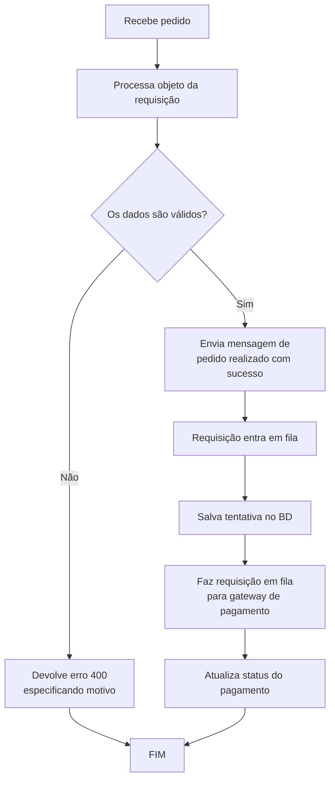
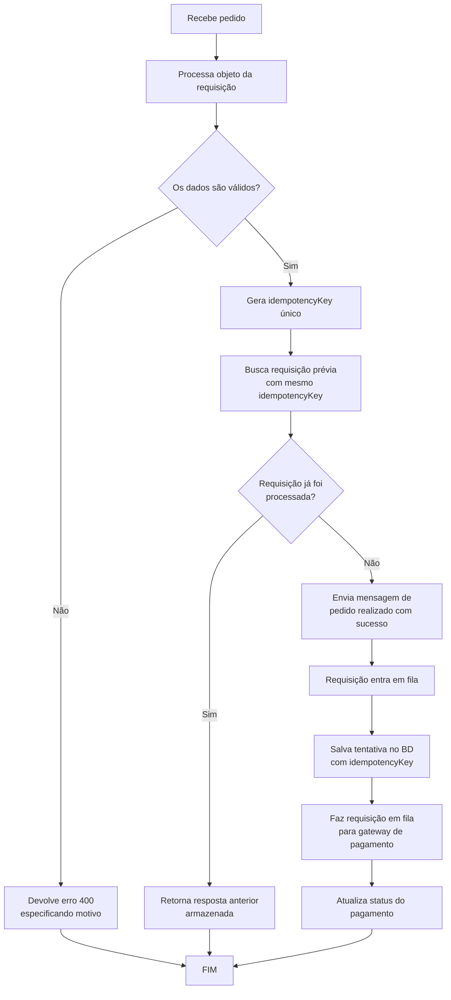
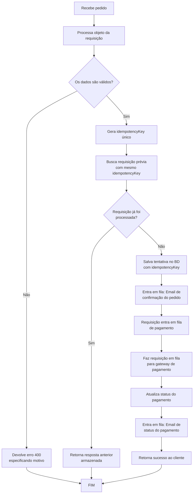

# Objetivos

Criar uma API responsável por receber requisições de pagamentos com cartão de crédito que seja capaz de lidar com alta carga, idempotência e mensageira.
O intuito é ter um produto resiliente e confiável. Ou seja, quando ele receber uma requisição, sem comportamento deve ser determinístico conforme os critérios de produto.

# Critérios de produto (MVP)

- Receber objeto com dados de compras:
  - produto;
  - valor;
  - dados do cartão de crédito;
  - dados do cliente.
- Processar requisições:
  - Salvar imediatamente a venda;
  - Processar o pagamento;
  - Informar o cliente do pagamento.

# Critérios de arquitetura

- Arquitetura camadas modulares (inspiração NestJs)
  - Controllers (recebem a requisição)
  - Services (regra de negócios)
  - Repositories (acesso ao banco de dados)

# Critérios de desenvolvimento

## Modelagem

### Order (Postgres)

```javascript
	model Order
	// <>Dados universais<>
	id uuid
	createdAt Date // UTC
	updatedAt Date // UTC
	// <>Dados da venda<>
	productId string // Sem significado atual. Pós MVP: deve referenciar ao model do produto
	price Number // Dado do cliente
	customerName String
	customerEmail String
	// <>Dados do pagamento<>
	paymentType Enum (CARD)
	paymentId String // id fornecido pelo gateway
	gatewayId String // id do gateway
	paymentStatus Enum (PENDING | PAIED | DENIED | CANCELED)
```

### IdempotencyKey (Redis)

```javascript
	Key: idempotencyKey (string - UUID)
	Value: {
		response: Object {
			orderId: string,
			paymentStatus: string,
			message: string
		},
		createdAt: timestamp (ISO8601),
		expiresAt: timestamp (ISO8601)
	}
	TTL: 86400 // 24 horas em segundos
```

## Tecnologias e bibliotecas (JavaScript)

- Typescript
- PostgreSQL
- Redis
- Prisma
- Zod
- Docker

## Rotas da API

### [POST] `/order`

Efetiva uma compra.

```json

    "product" : {
        "id": "string",
        "price": "number"
    },
    "customer": {
        "name": "string",
        "email": "string"
    },
    "payment": {
        "type": "string/enum (CARD)",
        "card": {
            "number": "string",
            "holderName": "string",
            "cvv": "string",
            "expirationDate": "string (MM/YY)"
        }
    }
```

### [GET] `/order/id/status`

Consulta o status de um pedido.

## Fluxograma da API - bases (MVP 0.1)

### Compra (sem fila)



### Verificar status da compra



## Fluxograma da API - fila (MVP 0.2)

### Compra



## Fluxograma da API - idempotência (MVP 0.3)

### Compra com idempotência



## Fluxograma da API - mensageria (MVP 0.4)

### Compra com idempotência e eventos de email


